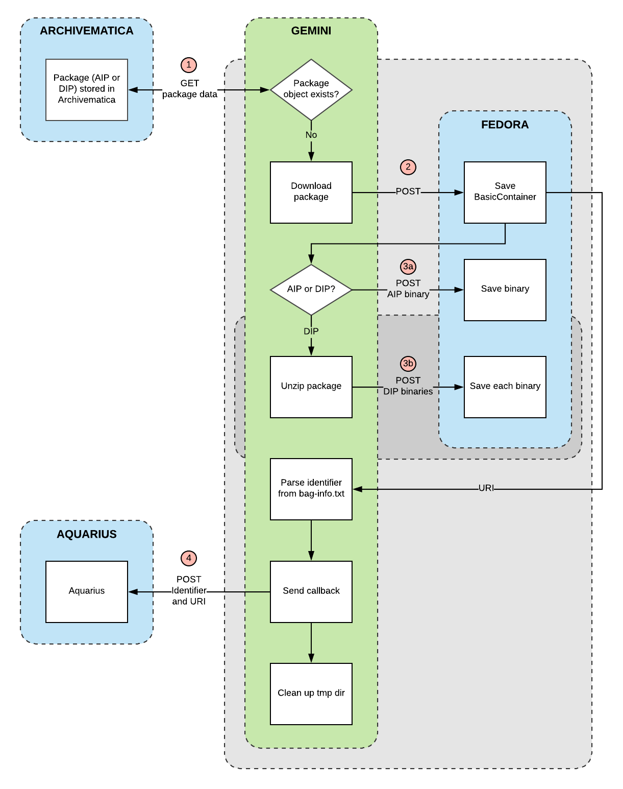

# gemini
A microservice to store AIPs and DIPs in Fedora.

## Setup

Clone the repository

    $ git clone git@github.com:RockefellerArchiveCenter/gemini.git

Install [Docker](https://store.docker.com/search?type=edition&offering=community) (trust me, it makes things a lot easier)

Run docker-compose from the root directory

    $ cd gemini
    $ docker-compose up

Once the application starts successfully, you should be able to access the application in your browser at `http://localhost:8006`

When you're done, shut down docker-compose

    $ docker-compose down

### Configuration

You will likely need to edit the values in `gemini/config.py` for your local environment.

## Usage

Packages are downloaded and stored when POST requests are sent to the `store/` and `download/` endpoints, respectively.

Download routines consist of the following steps:
- Polling the Archivematica Storage Service for packages.
- Determining if the package has already been stored by checking whether or not it exists as an object in Gemini's database. If the package has already been processed, Gemini skips it and goes to the next one.
- Downloading the package from the Archivematica Storage Service.

Storage routines consist of the following steps:
- Storing the package in Fedora, along with minimal metadata.
- Creating a package object in Gemini's database.
- Delivering a POST request to a configurable URL. This request has a payload containing the URI of the stored package in Fedora, the package type ("aip" or "dip") and the value of the `Internal-Sender-Identifier` field from the package's `bag-info.txt` file.

### Routes

| Method | URL | Parameters | Response  | Behavior  |
|--------|-----|---|---|---|
|GET|/packages| |200|Returns a list of packages|
|GET|/packages/{id}| |200|Returns data about an individual package|
|POST|/download/||200|Runs the download routine|
|POST|/store/||200|Runs the store routine|

## License

Gemini is released under an MIT License. See [LICENSE](LICENSE) for details.
